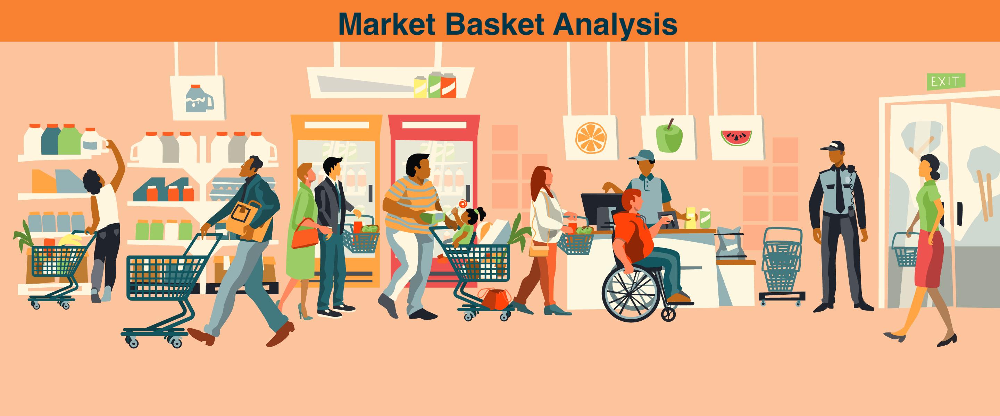
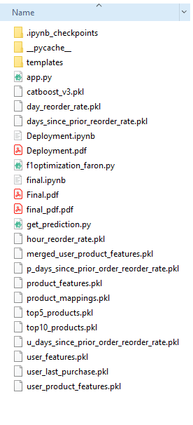

# Instacart-Market-Basket-Analysis
End to End case study based on Kaggle problem.

## Description
In this project we will try to solve Kaggle's Instacart Market Basket Analysis problem.

To know more about the approach, refer my medium blog post,

Part 1:

Part 2:

Part 3: 

## Data Files
- All files used in this project, are generated through Feature Engineering. All py files needed to do this are added to this repo.
- Since all of those files can't be uploaded here, I will leave a project directory structure, incase anyone wants to clone this repo and reproduce results.

The following directory Structure is followed for deployment folder

## Deployed application

## Future Work
- [ ]  Deploy this application on a remote server using AWS.
- [ ] Display Images of products along with the names instead of names alone.
- [ ] To find an end to end Deep Learning solution for this problem. 
- [ ] Extend this solution, to provide even more recommendations , such as for each product from the recommendations, suggest an item which was most frequently purchased with it . This can be done using Apriori Algorithm.

## References
1. [Faron's implementation of F1- Maximization](https://www.kaggle.com/mmueller/f1-score-expectation-maximization-in-o-n)
2. [Optimizing F-Measures: A Tale of Two Approaches](https://icml.cc/Conferences/2012/papers/175.pdf)
3. [Solution by Paulantoine for this kaggle challenge](https://www.kaggle.com/paulantoine/light-gbm-benchmark-0-3692)
4. [2nd Place Solution by Kazuki Onodera](https://github.com/KazukiOnodera/Instacart)
5. [Kaggle discussion thread by saggie anthony on how to improve the model](https://www.kaggle.com/c/instacart-market-basket-analysis/discussion/35048)
6. [AppliedAI Course](https://www.appliedaicourse.com/course/11/Applied-Machine-learning-course)
7. [Training Data Design approach by Symeon Kokovidis 's kernel](https://www.kaggle.com/kokovidis/ml-instacart-f1-0-38-part-two-xgboost-f1-max)
8. [Reduce the size of your dataframe](https://towardsdatascience.com/make-working-with-large-dataframes-easier-at-least-for-your-memory-6f52b5f4b5c4)
9. [NMF to reduce sparsity](https://www.kaggle.com/themissingsock/matrix-decomposition-with-buyer-data)
10. [Catboost documentation](https://catboost.ai/docs/concepts/python-reference_catboostclassifier.html)
11. [Flask Tutorials](https://www.tutorialspoint.com/flask/index.htm)
12. [HTML and CSS tutorials](https://www.w3schools.com/)
